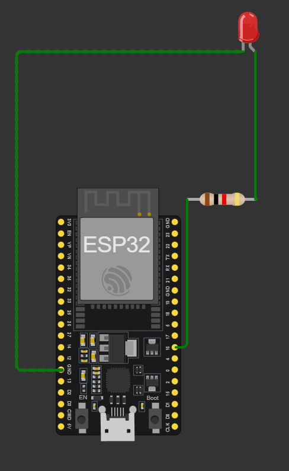

# ESP-32-electronic-circuit
Design any electronic circuit contain ESP 32 
# Arduino LED Blink Project

This project demonstrates how to blink an LED using an ESP 32. The LED is connected to pin 16 of the ESP 32 , and it blinks on and off at 100ms intervals on WOKWI. 

## Components Required

- ESP 32 
- LED
- Resistor (220Ω recommended)

## Circuit Diagram

1. Connect the longer leg (anode) of the LED to pin 16 of the ESP 32.
2. Connect the shorter leg (cathode) of the LED to one end of the resistor.
3. Connect the other end of the resistor to the GND pin on the ESP 32.

## Code

```cpp
#define LEDPIN 16

void setup() {
  pinMode(LEDPIN, OUTPUT);
}

void loop() {
  digitalWrite(LEDPIN, HIGH);
  delay(100);
  digitalWrite(LEDPIN, LOW);
  delay(100);
}
```
link 
## https://wokwi.com/projects/404201411446591489

